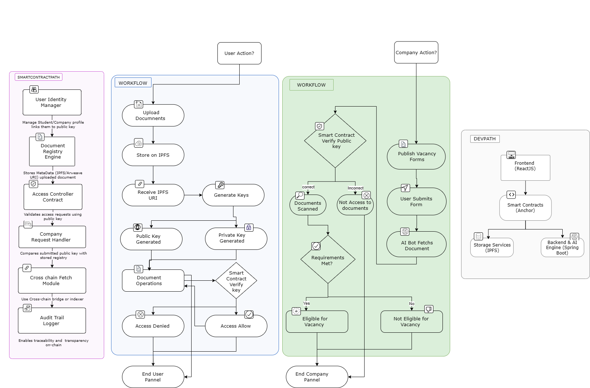

# Vaultify — AI-Powered Document Verification on Solana

Vaultify is a decentralized application (dApp) that solves the inefficiencies of document verification in education and recruitment. Built on the Solana blockchain, Vaultify uses smart contracts, IPFS for decentralized storage, and AI to automate eligibility checks for job or internship applications. It significantly reduces time, error, and redundancy for students, institutions, and companies.

---

## Project Architecture

### Components

- **User Panel (Students, Institutes):**
  - Upload and manage documents
  - Generate public/private keys for secure access
  - Store data using IPFS and access via smart contract

- **Company Panel (HR, Recruiters):**
  - Post job/internship opportunities
  - Retrieve documents using public key
  - Use AI to verify candidate eligibility against job requirements

- **Smart Contract System:**
  - Manages identity, access, and audit trails
  - Verifies keys and links users to IPFS document metadata
  - Ensures traceability and on-chain validation

---

## Problem Statement

Current document verification processes for internships, jobs, and campus placements are highly inefficient. Students are required to repeatedly upload the same documents across multiple platforms, often leading to mismatches, outdated files, or even fake certificates. Institutes manually forward student documents to companies, increasing workload and error rates. Companies, in turn, waste time and resources reviewing unverified, ineligible candidates.

During the SAP Labs Hackfest 2025, this exact problem was highlighted by HR managers as a significant bottleneck. Manually scanning candidate documents, validating details, and communicating with multiple institutions leads to major time and cost overheads.

---

## Solution

Vaultify solves this problem by offering a decentralized, AI-powered platform:

1. **One-Time Document Upload**
   - Students upload academic documents to IPFS via the user panel.
   - IPFS returns a URI that is linked through a smart contract on Solana.

2. **Key-Based Access Control**
   - Each document set is associated with a public key (view-only) and a private key (edit access).
   - Students can share public keys with recruiters, allowing secure read access to documents.
   - Institutions use private keys to update semester-wise records as needed.

3. **Smart Contract Verification**
   - All public key access is validated through smart contracts.
   - Unauthorized access is automatically blocked.

4. **AI Eligibility Bot**
   - Companies define requirements in vacancy forms.
   - When a student submits their public key, AI scans their documents to determine eligibility.
   - Only eligible profiles are stored and processed by the company.

5. **Decentralized Workflow**
   - Institutes no longer need to send documents manually.
   - Companies no longer need to validate raw certificates one-by-one.
   - Everything is verified and tracked on-chain.

---

## Tech Stack

| Layer               | Technology                         | Purpose                                                   |
|--------------------|------------------------------------|-----------------------------------------------------------|
| Frontend           | React.js                           | User interface for students, institutions, companies      |
| Smart Contracts    | Solana Blockchain with Anchor      | On-chain logic for identity, verification, and access     |
| Storage Layer      | IPFS (InterPlanetary File System)  | Decentralized document storage                            |
| Backend & AI Logic | Spring Boot, Python (FastAPI/AI)   | Document scanning, requirement matching, API services     |
| Identity System    | Public/Private Key Pairing         | Role-based access for viewing and modifying documents     |
| Audit Logging      | On-Chain Smart Contracts           | Traceability of document access and updates               |

---

## Key Features

- Secure, decentralized document storage using IPFS
- Smart contract-controlled access via public/private keys
- One-time upload for students and lifelong record ownership
- AI-driven document scanning based on company requirements
- Scalable architecture for education institutions and companies
- Verified documents only, reducing HR screening time and cost

---

## Project Status

- Frontend complete with document upload, form, and access panel
- IPFS integration and key generation implemented
- Smart contracts under testing phase (Anchor + Solana)
- AI eligibility agent in development
- GitHub repository and high-level architecture available

---

## Repository

Project source code, architecture diagram, and technical documentation:

[Vaultify GitHub Repository](https://github.com/vipinraj32/vaultify-solana)

---

## Contact and Contribution

Project Lead: Vipin Singh  
If you are a developer, contributor, or grant reviewer, feel free to explore the repo or get in touch.

For technical queries or contributions, open an issue or pull request on GitHub.

---

## License

This project is licensed under the MIT License.
